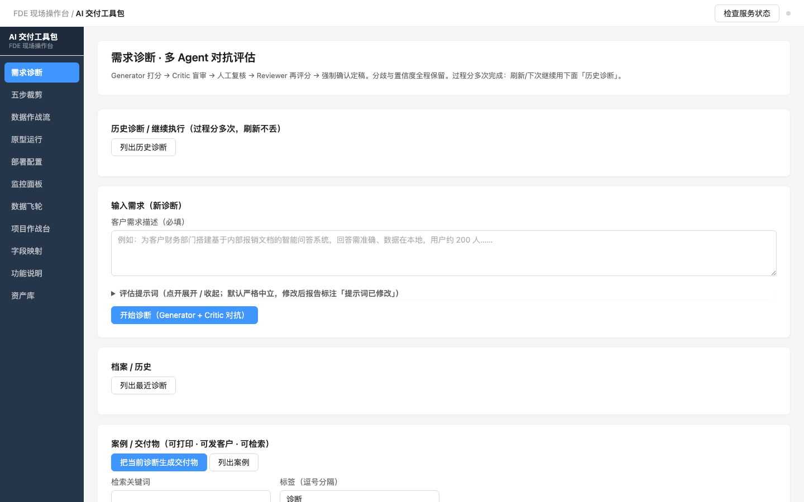
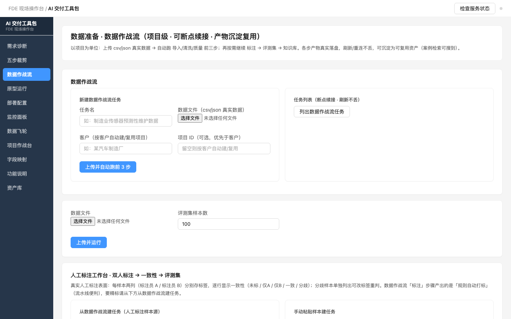
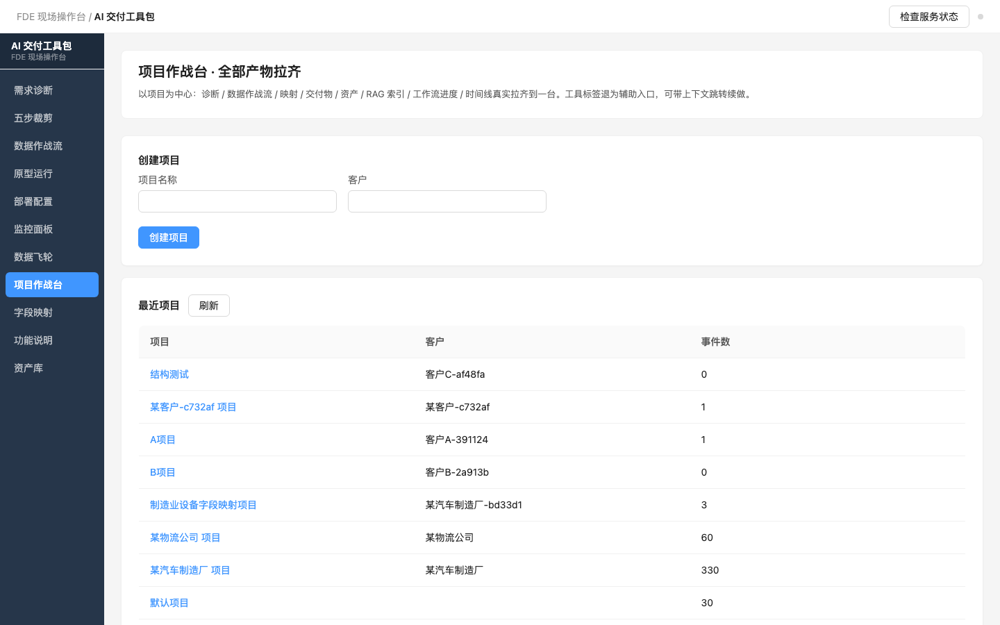
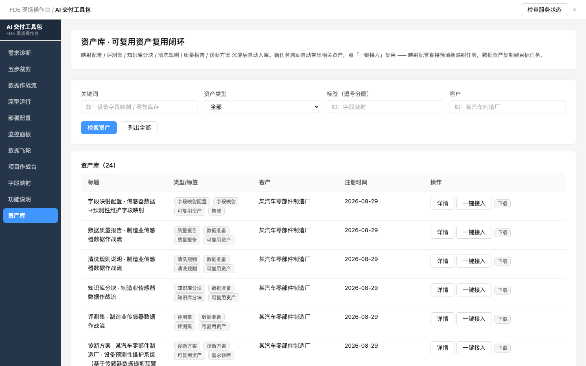

<div align="center">

# AI Field Delivery Toolkit

**A modular delivery toolbox for FDEs (Forward Deployed Engineers) — the complete AI project delivery loop, from requirements diagnosis to the data flywheel**

[](CHANGELOG.md)
[](tests/)
[](LICENSE)
[](pyproject.toml)
[](docs/api.md)

[简体中文](./README.md) · **English**

</div>

---

## One-liner

Handles the dirty, heavy work of delivering AI projects on-site as an **FDE (Forward Deployed Engineer)** — requirements diagnosis, data preparation, prototype validation, integration mapping, deployment, monitoring, and asset reuse — while staying **local-first, offline-capable, and keeping customer data inside the customer's network**.

**North Star**: not saving time, but doing the job well (quality + reputation). Time savings are a byproduct of the system's ability to accumulate and compound assets.

---

## Key Features

| Capability | Description |
| ---- | ---- |
| 🎯 **Requirements Diagnosis (multi-agent adversarial)** | Generator scores → Critic blind review → human review → Reviewer re-score → forced confirmation. 5 AI-feasibility dimensions + non-technical feasibility + **commercial proposal** (investment/phases/milestones/responsibility list/pilot & exit/alternatives) |
| 🔄 **Data War Room (pipeline)** | Project-level 6-step pipeline (import → clean → quality → annotate → eval set → knowledge base), **resumable by run_id** (refresh-safe), every artifact really written to disk |
| 🔗 **Field Mapping Workbench** | Import real sample CSV → mappings **actually executed & validated** (per-field pass/warn/fail + reasons + success rate) → human fix & iterate → export adapter, resumable throughout |
| 🧠 **Prototype + RAG** | 4 Agent templates **all calling DeepSeek for real** (QA / information extraction / multi-step reasoning / reflexion); QA runs RAG (ChromaDB vectorize → retrieve → **answer with citations**, honestly says "I don't know" when it doesn't) |
| 🗂 **Project War Room** | Project-centric: open one project and **all its artifacts are pulled together** — diagnosis / data / mapping / deliverables / assets / RAG / workflow progress / timeline, one-click jump to continue |
| ♻️ **Asset Reuse Loop** | Every delivery's reusable assets (eval sets / cleaning rules / mapping configs / KB chunks) are auto-registered, **auto-surfaced + one-click adoption** on the next delivery — more projects, stronger toolkit |
| 🛡 **Hardened Quality Gates** | "No prototype without qualified data" and "must confirm before sending to customer" go from display-only to **real blocking** (403/400 with explainable reasons), with an honest human force-override channel |
| 🏷 **UI** | 11-tab FDE console in an **Ant Design Pro** enterprise style, zero-build pure HTML/CSS/JS, offline |

> Details: [docs/api.md](docs/api.md) (full API) and [docs/统一底座架构设计.md](docs/统一底座架构设计.md) (design-era authority, in Chinese).

---

## Screenshots

**Requirements Diagnosis**



**Data War Room**



**Project War Room**



**Asset Library**



---

## Architecture

```
unified core/ (config · logging · security · degradation · registry · database)
        │  modules never read env directly / never init logging themselves
        ▼
diagnosis (should we do AI?) → cropper (what to cut) → dataprep (data war room)
→ prototype (Agent + RAG) → deploy (deployment config) → monitor (metrics)
                        └── data_flywheel / assets (feedback loop + asset compounding) ──┘
```

**6-step SOP**: Requirements Diagnosis → Data War Room (**hard gate**: no prototype without qualified data) → On-site Prototype → Deploy & Integrate (human confirmation before customer) → Delivery & Settlement (doc package + case archive) → Asset Reuse Loop.

---

## Quick Start

### Requirements
- Python 3.11+ · Docker & Docker Compose · ≥8 GB RAM

### Launch (5 steps)

```bash
# 1. Clone & enter
git clone https://github.com/heweidong-ecco/ai-field-delivery-toolkit.git
cd ai-field-delivery-toolkit

# 2. Environment variables (fill DEEPSEEK_API_KEY etc.)
cp .env.example .env

# 3. Install deps (skip if the bundled venv/ exists)
pip install -r requirements.txt

# 4. One-click init (check Python/Docker → .env → deps → infra)
./scripts/setup.sh

# 5. Start the console; open http://localhost:8100/ in a browser
python -m core.main
```

> Infra (PostgreSQL / Redis / ChromaDB): `make up` to start, `make check` for health, `make init-db` for tables.

### No LLM key?

No problem. Diagnosis/mapping have **rule-based fallback**; prototype/retrieval **honestly report the error**. Every example supports `--stub` (deterministic, offline, seconds). See [FAQ](#faq).

---

## Modules

| Module | Responsibility | Status |
| ---- | ---- | ---- |
| `core/` | Unified base: config, logging, security (PII/injection/review), degradation, registry, DB | ✅ |
| `diagnosis/` | Requirements diagnosis: multi-agent adversarial + version loop + client feedback + commercial proposal | ✅ |
| `cropper/` | 5-step crop: constraints → enabled/removed modules + timeline; importable from diagnosis | ✅ |
| `data_prep/` + `dataprep/` | Data ingestion/cleaning/eval set + **Data War Room** (6-step resumable pipeline) | ✅ |
| `prototype_assembler/` | Prototype: 4 templates calling DeepSeek for real, QA runs RAG | ✅ |
| `deploy_hardener/` | Deployment hardening: Docker + degradation plan + env pre-check | ✅ |
| `monitor/` | Monitoring: metrics/alerts/dashboard + **real LLM usage/cost** (billing hooks) | ✅ |
| `data_flywheel/` | Data flywheel: feedback → label pool → eval set update → asset export | ✅ |
| `cases/` | Case/deliverable layer: printable HTML/PDF + structured archive + search | ✅ |
| `projects/` | Project war room: process record + **full-artifact aggregation (warroom)** + gates | ✅ |
| `mapping/` | Field mapping workbench: real-sample execution validation → adapter export | ✅ |
| `annotation/` | Human double-annotation workbench: A/B consistency → dispute fix → eval set | ✅ |
| `kb/` + `retrieval/` | KB chunking/QA + RAG Q&A (with citations) | ✅ |
| `assets/` | Reusable asset registry: auto-register + auto-surface + one-click adoption | ✅ |

---

## Examples

One runnable example per module (`python examples/xxx_example.py`):

| Module | Example |
| ---- | ---- |
| Requirements diagnosis | `examples/diagnosis_example.py` |
| Data prep / war room | `examples/data_prep_example.py` |
| Prototype (4 real-LLM templates) | `examples/prototype_example.py` |
| 5-step crop | `examples/cropper_example.py` |
| Deploy / monitor / flywheel | `deploy_example.py` / `monitor_example.py` / `data_flywheel_example.py` |
| Case deliverables | `examples/cases_example.py` |
| KB / mapping / projects | `kb_example.py` / `mapping_example.py` / `projects_example.py` |
| Human annotation | `examples/annotation_example.py` |
| **Full-chain pilot** | `examples/pilot_example.py --stub` (seconds, reproducible; drop `--stub` to call DeepSeek for real) |

---

## Real Case Study

> A reproducible "real customer project" since v1.12.0 — the full toolchain run end-to-end on a real manufacturing customer, producing a **customer-facing deliverable package**.

**An auto-parts manufacturer · equipment predictive maintenance** (manufacturing): diagnosis → data war room (clean/quality/annotate/eval set/KB chunks + auto-index) → prototype + RAG → field mapping (execution validation) → deployment config → project war room → doc package.

```bash
python examples/pilot_example.py --stub      # stubbed, reproducible in seconds
python examples/pilot_example.py             # real DeepSeek (~2-4 min)
```

Output: `tmp/web/pilot/<customer>/` (project overview + diagnosis HTML + doc package HTML + warroom snapshot). Honestly labeled `llm_mode`: `real` / `stub`.

---

## Tech Stack

| Component | Choice |
| ---- | ---- |
| Language | Python 3.11 |
| Web | FastAPI (zero-build frontend, vanilla HTML/CSS/JS) |
| Storage | PostgreSQL 16 · Redis 7 · ChromaDB (vector) |
| LLM client | Custom unified `core/llm.py` (DeepSeek/OpenAI-compatible, billing hooks feed monitoring) |
| Agent framework | Thin custom wrapper (harness / loop / memory / tools / context) |
| Deployment | Docker Compose / systemd |

---

## FAQ

**Q1: How is this different from using LangChain / the DeepSeek API directly?**
Calling an API directly solves a *single* AI capability. This toolkit solves the *whole delivery chain* for an on-site FDE: whether AI fits (diagnosis), how to prepare data (war room), how to map fields (workbench), how to configure deployment (hardener), how to monitor after launch, and how to reuse what you built. Single-point capabilities have replacements; **connecting the delivery chain + asset compounding** is the moat.

**Q2: Does customer data leave their network?**
No. The toolkit is **local-first and offline-capable**; data lives in local `tmp/`, vectors in local ChromaDB. The only network calls are: first-time LLM calls (DeepSeek API) and the first semantic-dedup embedding model download (~79 MB, pre-cacheable to `~/.cache/chroma/onnx_models/`).

**Q3: Can I run without a DEEPSEEK_API_KEY?**
Yes. Diagnosis/mapping have **rule-based fallback** (still produce results); prototype/retrieval **honestly report** the missing key — never fake success. Every example runs fully offline with `--stub`.

**Q4: 11 tabs — where do I start?**
Follow the delivery flow: ① Diagnosis → ③ Data War Room → ④ Prototype → ⑨ Field Mapping → ⑧ Project War Room (see everything). ⑩ is a built-in usage guide (with dynamic suggestions); ⑪ is the asset library.

**Q5: What does "resumable" mean?**
Diagnosis / data war room / mapping tasks are archived by `run_id`. Shut the laptop mid-project, restore from "History" next time — progress, artifacts and finished steps are all there, **refresh-safe**.

**Q6: How do I run the tests?**
```bash
source venv/bin/activate
make test        # pytest tests/ (163 cases)
make test-cov    # coverage report
```

**Q7: How do I contribute / extend?**
Issues and PRs welcome. Conventions: Chinese comments, English business identifiers, schemas are additive-only, existing tests stay green, new features sync the example + README module table + CHANGELOG. Iteration records live in `refactor/` and `notes/`.

**Q8: License?**
[MIT](LICENSE). Commercial use, modification and redistribution are allowed as long as the copyright notice is kept.

**Q9: The monitoring panel shows this toolkit's own LLM cost, not the customer system — right?**
Correct. It is currently scoped to **the delivery tool's own usage/cost dashboard** (real billing hooks). Customer production-system monitoring is out of scope for now (design decision Q12: no Grafana re-implementation).

---

## Docs

- [API reference](docs/api.md) · [Unified base architecture (design-era, zh)](docs/统一底座架构设计.md)
- [Development process](docs/development-process.md) · [Security baseline](docs/security-baseline.md) · [Config spec](docs/config-spec.md) · [Version spec](docs/version-spec.md)
- [Usage guide (zh)](docs/usage-guide.md)
- Decision records: `notes/` (T-001…T-021) · Iteration archive: `refactor/`

## Versioning / Release

Version is kept in sync in four places: `pyproject.toml` / `core/__init__.py` / README "current version" / `CHANGELOG.md`.

```bash
./scripts/release.sh 1.15.0   # test → build image → tag → record rollback
./scripts/rollback.sh 1.15.0  # rollback
```

## License

[MIT](LICENSE) © 2026 heweidong
